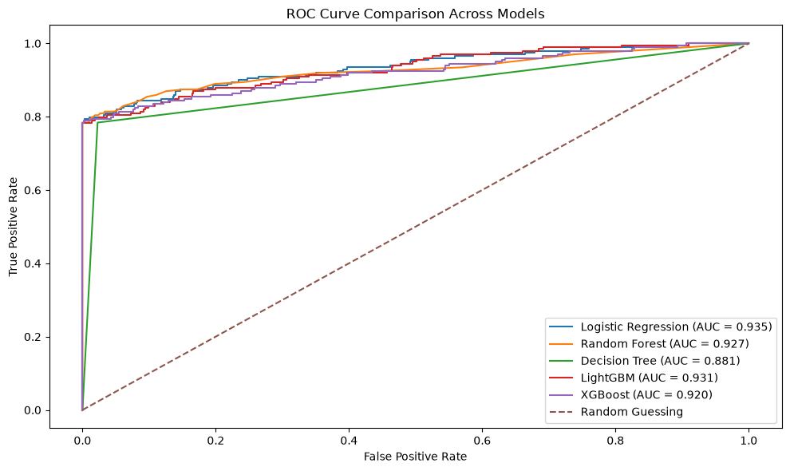
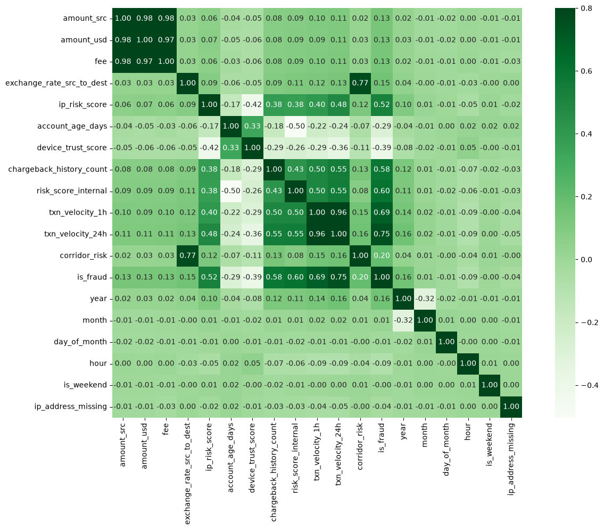
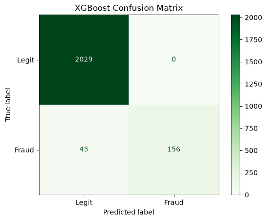
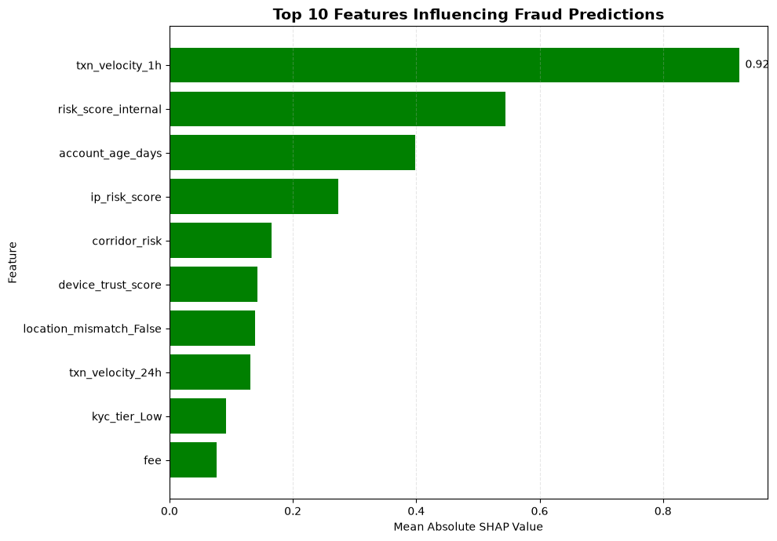
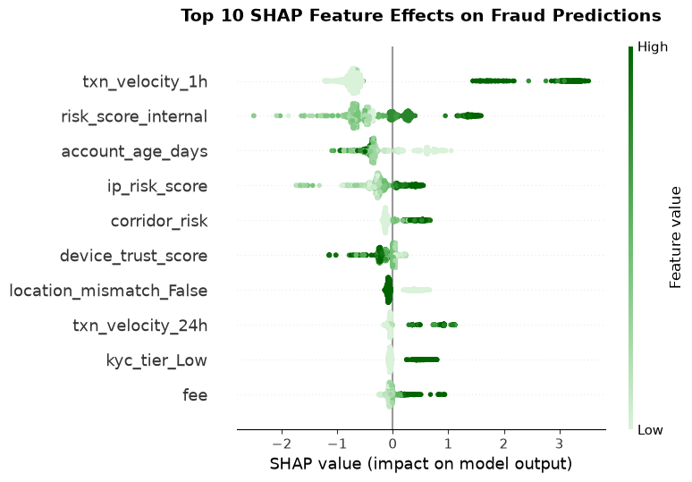
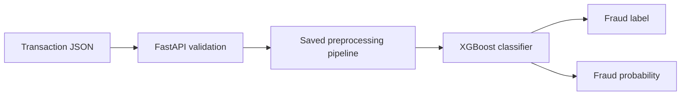

# NovaPay Fraud Detection System

> An end-to-end machine learning solution for detecting suspicious cross-border transactions using XGBoost, SHAP, FastAPI, and Docker.

## Table of Contents

- [Project Overview](#project-overview)
- [Company Overview](#company-overview)
- [Business Problem](#business-problem)
- [Project Rationale](#project-rationale)
- [Project Objectives](#project-objectives)
- [Dataset Overview](#dataset-overview)
- [Solution Approach](#solution-approach)
- [Exploratory Data Analysis](#exploratory-data-analysis)
- [Project Workflow](#project-workflow)
- [Key Results](#key-results)
- [Model Performance](#model-performance)
- [SHAP Explainability](#shap-explainability)
- [Deployment](#deployment)
- [Business Recommendations](#business-recommendations)
- [Learning Opportunities and Skills Developed](#learning-opportunities-and-skills-developed)
- [Project Structure](#project-structure)
- [How to Run](#how-to-run)
- [Technologies Used](#technologies-used)
- [Limitations](#limitations)
- [Future Improvements](#future-improvements)
- [Conclusion](#conclusion)

---

## Project Overview

The NovaPay Fraud Detection System is an end-to-end machine learning project developed to identify potentially fraudulent digital money-transfer transactions while minimizing disruption to legitimate customers.

The project covers the complete data science lifecycle:

- business and problem understanding;
- data cleaning and validation;
- exploratory data analysis;
- feature engineering;
- class-imbalance handling;
- supervised model development;
- hyperparameter tuning;
- model comparison and evaluation;
- explainability with SHAP;
- deployment through FastAPI;
- containerization with Docker.

Five classification algorithms were compared:

1. Logistic Regression
2. Decision Tree
3. Random Forest
4. LightGBM
5. XGBoost

After cross-validated comparison and tuning, XGBoost was selected as the final model. The complete preprocessing and prediction pipeline was saved, exposed through a FastAPI `/predict` endpoint, and successfully tested inside a Docker container.

---

## Company Overview

NovaPay is a digital-first cross-border money-transfer company based in Toronto, Canada, with operations in Canada, the United Kingdom, and the United States.

The company enables customers to:

- send money internationally;
- receive cross-border payments;
- hold multiple currencies;
- support family members abroad;
- manage international payroll;
- receive global freelance payments.

NovaPay’s operating model is built around:

- affordability;
- fast transaction processing;
- accessible digital experiences;
- transparent international money movement;
- secure transaction handling.

The platform processes millions of monthly cross-border transactions and serves a broad customer base, including expatriates, businesses, and freelancers.

Because NovaPay’s customer satisfaction strategy depends heavily on secure and reliable transaction processing, early and accurate fraud detection is a strategic priority.

---

## Business Problem

NovaPay faces increasing fraud risk as digital transaction volumes grow and fraud tactics become more sophisticated.

### Operational Challenges

The platform must make transaction decisions quickly, limiting the amount of manual review that can be performed in real time.

Static rules and manual review processes may struggle to:

- scale with transaction growth;
- adapt to changing fraud behavior;
- detect complex transaction patterns;
- respond quickly to new fraud tactics.

Common fraud threats in the business scenario include:

- identity theft;
- account takeover;
- unauthorized payments;
- transaction laundering;
- abnormal device behavior;
- suspicious transaction velocity;
- risky cross-border payment corridors.

### Financial Challenges

Fraud can create direct and indirect costs through:

- unauthorized transaction losses;
- refunds;
- chargebacks;
- compliance penalties;
- investigation expenses;
- increased operational workload.

False positives also create business damage. Legitimate customers may experience delays, blocked transfers, frustration, and reduced trust.

Missed fraud creates the opposite risk by increasing financial losses and operational burden.

### Regulatory Challenges

Digital payment platforms are expected to maintain transparent and auditable fraud controls.

Relevant areas include:

- Know Your Customer (KYC);
- Anti-Money Laundering (AML);
- explainable decision-making;
- traceable transaction review;
- accountable model governance.

A fraud model that performs well but cannot explain its decisions may be difficult to use responsibly in a regulated environment.

### Data Science Challenge

Fraud is the minority class in the dataset.

The project dataset contained:

- **10,403 legitimate transactions**
- **997 fraudulent transactions**
- **8.75% fraud**
- **91.25% legitimate transactions**

The supplied business brief described fraud as representing less than 1% of transactions. However, the actual dataset used in this analysis contained approximately 8.75% fraud. All modeling decisions and reported results are therefore based on the observed dataset.

Accuracy alone is not sufficient for this problem. The project emphasized:

- fraud precision;
- fraud recall;
- F1 score;
- ROC-AUC;
- confusion-matrix performance.

---

## Project Rationale

The digital-payments industry is moving toward automated and intelligence-driven fraud prevention.

This project is relevant because effective fraud detection can:

### Protect Platform Integrity

Accurate fraud screening can reduce financial losses and help maintain trust with customers and regulators.

### Improve Operational Performance

Fraud teams can prioritize high-risk transactions instead of reviewing all transactions equally.

### Improve Customer Experience

Reducing false positives means fewer legitimate transactions are delayed or incorrectly blocked.

### Strengthen Competitive Advantage

Machine-learning-driven fraud detection is becoming increasingly important across fintech and digital-payment platforms.

### Support Regulatory Compliance

Transparent and explainable model outputs can improve auditability and institutional trust.

### Improve Scalability

A reusable API and Docker container create a technical foundation for integrating the model into other transaction systems.

---

## Project Objectives

The project focused on the following objectives:

1. **Build supervised classifiers** capable of distinguishing fraudulent transactions from legitimate transactions.

2. **Handle class imbalance** using suitable approaches such as class weighting and XGBoost’s `scale_pos_weight`.

3. **Compare multiple algorithms** using precision, recall, F1 score, ROC-AUC, and confusion-matrix results.

4. **Tune model hyperparameters** using GridSearchCV and cross-validation.

5. **Use SHAP explainability** to identify the features that most strongly influenced fraud predictions.

6. **Save the complete preprocessing and prediction pipeline** for consistent inference.

7. **Deploy the model through FastAPI** for real-time transaction scoring.

8. **Containerize the API with Docker** for portability across environments.

9. **Return both a fraud label and fraud probability** to support risk-based decisions.

The supplied business brief proposed at least a 15% improvement in recall over a previous rules-based baseline. However, no measured rules-based baseline was available in the completed analysis. This should therefore be treated as a proposed target rather than a verified project result.

---

## Dataset Overview

The dataset represents cross-border financial transactions and includes:

### Transaction Features

- source and destination currencies;
- transaction amounts;
- transaction fees;
- exchange rates;
- payment channel.

### Customer and Account Features

- home country;
- account age;
- KYC tier;
- chargeback history.

### Device and Location Features

- new-device status;
- device trust score;
- IP country;
- location mismatch;
- IP risk score.

### Behavioral and Risk Features

- one-hour transaction velocity;
- 24-hour transaction velocity;
- corridor risk;
- internal risk score.

### Time Features

The timestamp was converted to datetime and used to create:

- year;
- month;
- day of month;
- day of week;
- hour;
- weekend indicator.

The binary target was:

```text
is_fraud
```

where:

- `0` = legitimate transaction;
- `1` = fraudulent transaction.

---

## Solution Approach

### 1. Data Cleaning and Validation

The dataset was reviewed for:

- missing values;
- invalid data types;
- duplicated records;
- outliers;
- inconsistent timestamps;
- negative transaction values;
- unsuitable identifiers.

Key cleaning steps included:

- converting `amount_src` to a numeric data type;
- handling missing values in categorical columns;
- converting timestamp values to datetime;
- removing rows with missing or invalid timestamps;
- investigating negative values before treatment;
- identifying and removing duplicate records;
- retaining meaningful outliers rather than deleting them automatically;
- dropping high-cardinality identifier columns not suitable as direct predictors.

### 2. Feature Engineering

Time-based features were extracted from valid timestamps.

Additional predictive signals included:

- transaction amount;
- fee;
- exchange rate;
- account age;
- transaction velocity;
- device trust;
- new-device status;
- location mismatch;
- IP risk;
- internal risk score;
- KYC tier;
- chargeback history;
- corridor risk.

The original timestamp was excluded from the final model feature set after its useful information had been represented through derived time features.

### 3. Train-Test Split

The data was divided into:

- `X`: model features;
- `y`: fraud target.

A stratified train-test split was used to preserve the fraud distribution across the training and test sets.

### 4. Preprocessing Pipeline

A reusable pipeline ensured that the same transformations were applied during training and deployment.

The pipeline handled:

- numerical features;
- categorical encoding;
- feature ordering;
- model fitting;
- prediction on new transactions.

### 5. Class-Imbalance Handling

The project used model-appropriate imbalance strategies, including:

- `class_weight="balanced"` for supported scikit-learn models;
- balanced weighting for LightGBM;
- `scale_pos_weight` for XGBoost.

SMOTE was also explored during model development. The final deployed model was selected through cross-validated comparison and weighted learning.

### 6. Model Comparison and Tuning

The following algorithms were compared:

| Model | Role |
|---|---|
| Logistic Regression | Interpretable linear baseline |
| Decision Tree | Simple nonlinear baseline |
| Random Forest | Bagging-based ensemble |
| LightGBM | Efficient gradient boosting |
| XGBoost | Regularized gradient boosting |

GridSearchCV evaluated **89 candidates** using **three-fold cross-validation**, resulting in **267 model fits**.

The best XGBoost configuration was:

```text
learning_rate = 0.05
max_depth = 3
n_estimators = 100
```

The best cross-validation F1 score was approximately **0.8944**.

### ROC Curve Comparison Across Models

<p align="center">
  
</p>

The ROC curves show that the evaluated models provided strong discrimination between legitimate and fraudulent transactions, while the Decision Tree produced the weakest ROC-AUC among the models shown.

---

## Exploratory Data Analysis

Exploratory data analysis was conducted to understand the structure of the transaction data, identify fraud-related patterns, assess class imbalance, and evaluate relationships among the numerical variables.

The analysis focused on:

- the distribution of legitimate and fraudulent transactions;
- transaction amounts and fees;
- account and device characteristics;
- transaction velocity;
- internal and external risk indicators;
- temporal transaction patterns;
- relationships between numerical variables and the fraud target.

### Fraud-Class Distribution

The cleaned dataset contained:

- **10,403 legitimate transactions**
- **997 fraudulent transactions**
- **8.75% fraudulent transactions**
- **91.25% legitimate transactions**

This imbalance confirmed the need to evaluate minority-class performance using precision, recall, F1 score, ROC-AUC, and confusion matrices rather than relying only on accuracy.

### Correlation Analysis

The correlation heatmap highlights relationships among transaction amounts, account behavior, risk indicators, and fraud.

<p align="center">
  
</p>

Key observations included:

- `txn_velocity_1h` and `txn_velocity_24h` were strongly correlated;
- fraud showed positive relationships with transaction velocity, internal risk score, chargeback history, and IP risk;
- account age and device trust showed negative relationships with fraud;
- transaction amount variables were strongly correlated with each other;
- exchange rate and corridor risk also showed a strong relationship.

These findings supported the inclusion of behavioral, account, device, and risk features during model development.

---

## Project Workflow

### Step 1: Data Collection and Profiling

- inspected dataset structure;
- reviewed data types;
- measured missingness;
- checked duplicate records;
- established baseline fraud prevalence.

### Step 2: Data Preparation

- cleaned and standardized variables;
- handled missing and invalid values;
- engineered temporal features;
- removed unsuitable identifiers;
- prepared model-ready data.

### Step 3: Exploratory Data Analysis

- examined fraud prevalence;
- compared legitimate and fraudulent transactions;
- studied channel, geography, time, and risk patterns;
- identified anomalies associated with fraud.

### Step 4: Model Development

- trained baseline models;
- applied class-weighting strategies;
- compared Logistic Regression, Decision Tree, Random Forest, LightGBM, and XGBoost;
- tuned candidate models using GridSearchCV.

### Step 5: Validation and Explainability

- evaluated the best model on the untouched test set;
- reviewed precision, recall, F1 score, ROC-AUC, and confusion matrix;
- used SHAP to explain feature importance and prediction direction.

### Step 6: Deployment

- saved the full XGBoost pipeline;
- validated the saved pipeline on legitimate and fraudulent transactions;
- created a FastAPI application;
- defined a Pydantic input schema;
- exposed a `/predict` endpoint;
- containerized the application with Docker;
- confirmed prediction consistency across notebook, local API, and Docker.

### Step 7: Monitoring and Improvement

Monitoring was included in the supplied project workflow as a production objective. It was not implemented in the current repository.

Recommended future monitoring includes:

- feature drift;
- prediction drift;
- fraud recall;
- false-positive rate;
- model-version logging;
- scheduled retraining.

---

## Key Results

The final tuned XGBoost model achieved:

| Metric | Result |
|---|---:|
| Accuracy | 0.98 |
| Test F1 Score | 0.879 |
| ROC-AUC | 0.942 |
| Fraud Precision | 1.00 |
| Fraud Recall | 0.78 |
| Correctly Detected Fraud | 156 |
| Missed Fraud | 43 |
| False Fraud Alerts | 0 |

### Confusion Matrix

|  | Predicted Legitimate | Predicted Fraud |
|---|---:|---:|
| **Actual Legitimate** | 2,029 | 0 |
| **Actual Fraud** | 43 | 156 |

<p align="center">
  
</p>

### Interpretation

The model produced no false-positive fraud alerts on the test set, which is valuable for customer experience and operational efficiency.

However, it missed 43 fraudulent transactions. The model should therefore support fraud screening, prioritization, and additional verification rather than fully replacing human review.

---

## Model Performance

### Why XGBoost Was Selected

XGBoost achieved the strongest cross-validation performance among the evaluated candidates and maintained strong performance on the holdout test set.

Its strengths included:

- strong nonlinear predictive performance;
- support for class imbalance;
- high fraud precision;
- strong ROC-AUC;
- probability-based outputs;
- compatibility with SHAP.

### Saved-Pipeline Validation

The complete pipeline was saved as:

```text
notebook/model/novapay_xgboost_pipeline.pkl
```

A known fraudulent transaction was correctly classified as fraud with approximately:

```text
99.38% fraud probability
```

A legitimate test transaction returned:

```json
{
  "prediction": "Legitimate",
  "fraud_probability": 0.0084
}
```

The same output was reproduced in:

1. the notebook;
2. the local FastAPI application;
3. the Dockerized API.

This confirmed that preprocessing and prediction were preserved across environments.

---

## SHAP Explainability

SHAP was used to explain the global behavior of the final XGBoost model.

Two primary visualizations were created:

- a top-10 mean absolute SHAP feature-importance chart;
- a top-10 SHAP beeswarm summary plot.

### Top 10 SHAP Feature Importance

<p align="center">
  
</p>

### Most Influential Features

The strongest model drivers included:

1. `txn_velocity_1h`
2. `risk_score_internal`
3. `account_age_days`
4. `ip_risk_score`
5. `corridor_risk`
6. `device_trust_score`
7. `location_mismatch`
8. `txn_velocity_24h`
9. `kyc_tier`
10. transaction-fee-related information

### SHAP Feature Effects

The summary plot below shows both the direction and strength of each feature's effect on the model output. Points to the right increase the fraud prediction, while points to the left reduce it. Darker green represents higher feature values and lighter green represents lower feature values.



### Interpretation

The SHAP analysis indicated that:

- high transaction activity within one hour strongly increased fraud predictions;
- higher internal risk scores increased predicted fraud risk;
- elevated IP and corridor risk pushed predictions toward fraud;
- newer accounts were more strongly associated with fraud predictions;
- lower device trust increased suspicion;
- higher 24-hour transaction velocity increased risk;
- weaker KYC status and location inconsistency could increase the fraud score.

SHAP explains the model’s behavior. It does not prove that these features caused fraud.

### Business Value

SHAP can help fraud analysts understand why a transaction was flagged.

For example, a high-risk transaction may combine:

- unusual recent transaction velocity;
- low device trust;
- risky IP behavior;
- a newer account;
- a high-risk payment corridor;
- elevated internal risk.

---

## Deployment

### FastAPI

The application exposes:

| Method | Endpoint | Purpose |
|---|---|---|
| GET | `/` | Confirms the API is running |
| POST | `/predict` | Returns fraud label and probability |
| GET | `/docs` | Opens Swagger documentation |

The API uses a Pydantic `Transaction` model to:

- validate request fields;
- enforce data types;
- generate an interactive request form;
- prevent malformed inputs.

### Example Response

```json
{
  "prediction": "Legitimate",
  "fraud_probability": 0.0084
}
```

### Docker

The application was containerized using Docker.

The Docker image was built as:

```text
novapay-fraud-api
```

The container packaged:

- Python;
- FastAPI;
- Uvicorn;
- pandas;
- scikit-learn;
- XGBoost;
- joblib;
- the saved pipeline;
- the API source code.

A successful request to the Dockerized `/predict` endpoint returned HTTP status code `200` and matched the notebook prediction.

### Deployment Flow



---

## Business Recommendations

1. **Use the model as a fraud-screening layer**  
   High-probability transactions should trigger additional verification, step-up authentication, temporary holds, or analyst review.

2. **Prioritize transaction velocity**  
   One-hour transaction velocity was the strongest model driver and should remain a core real-time risk signal.

3. **Combine model scores with business controls**  
   Fraud probability should be considered alongside KYC status, device intelligence, account history, chargeback behavior, and transaction context.

4. **Review missed fraud cases**  
   The 43 false negatives should be profiled to identify patterns the current feature set did not capture.

5. **Tune the decision threshold**  
   The final threshold should reflect the business cost of missed fraud versus the cost of false positives.

6. **Maintain human oversight**  
   The model should support decision-making rather than automatically reject all transactions classified as fraud.

7. **Monitor the model after deployment**  
   Fraud behavior changes. Precision, recall, drift, and prediction distributions should be monitored regularly.

---

## Learning Opportunities and Skills Developed

### Technical Skills

- fraud detection with imbalanced data;
- supervised classification;
- ensemble learning;
- class weighting;
- preprocessing pipelines;
- hyperparameter tuning;
- model comparison;
- precision, recall, F1, and ROC-AUC evaluation;
- confusion-matrix interpretation;
- SHAP explainability;
- model serialization with joblib;
- FastAPI development;
- Pydantic validation;
- Docker containerization.

### Financial Services and Fintech Concepts

- digital payment transaction flows;
- cross-border money transfer;
- chargebacks;
- fraud-screening lifecycle;
- KYC and AML context;
- customer-experience trade-offs;
- transaction risk prioritization.

### Professional Skills

- translating business problems into machine learning solutions;
- selecting metrics that reflect business risk;
- documenting assumptions and limitations;
- communicating findings to non-technical stakeholders;
- building an end-to-end portfolio project;
- connecting modeling work to deployment.

The supplied learning objectives also mentioned drift detection and production monitoring. Those were not implemented in the current repository and are included as future improvements.

---

## Project Structure

```text
Novapay_fraudulent/
│
├── data/
│   └── nova_pay_combined.csv
│
├── docs/
│   ├── business_problem.md
│   ├── methodology.md
│   ├── model_evaluation.md
│   └── deployment.md
│
├── notebook/
│   ├── model/
│   │   └── novapay_xgboost_pipeline.pkl
│   └── EDA.ipynb
│
├── assets/
│   ├── class_distribution.png
│   ├── confusion_matrix.png
│   ├── roc_curve.png
│   ├── shap_importance.png
│   ├── shap_summary.png
│   └── api_response.png
│
├── app.py
├── Dockerfile
├── .dockerignore
├── requirements.txt
├── .gitignore
└── README.md
```

Only include files and folders that actually exist in the final repository.

---

## How to Run

### 1. Clone the Repository

```bash
git clone <your-repository-url>
cd Novapay_fraudulent
```

### 2. Create a Virtual Environment

Windows:

```powershell
python -m venv nova-venv
.\nova-venv\Scripts\Activate.ps1
```

macOS or Linux:

```bash
python -m venv nova-venv
source nova-venv/bin/activate
```

### 3. Install Dependencies

```bash
python -m pip install -r requirements.txt
```

### 4. Run FastAPI Locally

```bash
python -m uvicorn app:app --reload
```

Open:

```text
http://127.0.0.1:8000/docs
```

### 5. Build the Docker Image

```bash
docker build -t novapay-fraud-api .
```

### 6. Run the Docker Container

```bash
docker run --name novapay-api -p 8000:8000 novapay-fraud-api
```

Open:

```text
http://127.0.0.1:8000/docs
```

### 7. Check the Running Container

```bash
docker ps
```

### 8. Stop the Container

```bash
docker stop novapay-api
```

### 9. Remove the Container

```bash
docker rm novapay-api
```

---

## Technologies Used

### Data Analysis and Machine Learning

- Python
- pandas
- NumPy
- scikit-learn
- XGBoost
- LightGBM
- SHAP

### Visualization

- Matplotlib
- Seaborn

### API and Validation

- FastAPI
- Pydantic
- Uvicorn

### Model Persistence

- joblib

### Deployment

- Docker
- Docker Desktop

### Development and Version Control

- Visual Studio Code
- Jupyter Notebook
- Git
- GitHub

---

## Limitations

### 1. Fraud Recall

The model missed 43 fraudulent transactions. Improving recall remains a priority.

### 2. No Measured Rules-Based Baseline

The supplied project brief proposed improvement over a previous rules-based system, but no measured baseline results were available for direct comparison.

### 3. Scenario and Dataset Mismatch

The supplied scenario described fraud prevalence below 1%, while the actual project dataset contained approximately 8.75% fraud.

### 4. Threshold Selection

The default classification threshold was used for final reporting. A production threshold should be chosen using the business cost of missed fraud and false positives.

### 5. Data Representativeness

The dataset may not represent future transactions, new fraud strategies, all regions, or all channels.

### 6. Fraud Drift

Fraud patterns change over time. Performance may decline without monitoring and retraining.

### 7. Probability Calibration

The model score is useful for ranking risk, but further calibration may be needed before interpreting it as an exact real-world probability.

### 8. Local Deployment

The API and Docker image were tested locally. Authentication, rate limiting, production logging, cloud hosting, and autoscaling were not implemented.

### 9. No Live External Risk Feeds

The solution does not currently connect to real-time sanctions, device-intelligence, identity-verification, merchant-risk, or fraud-network services.

---

## Future Improvements

### Modeling

- tune the classification threshold;
- optimize for fraud recall and precision-recall AUC;
- investigate false-negative fraud cases;
- test probability calibration;
- use repeated stratified cross-validation;
- consider time-aware validation.

### Data

- add merchant and beneficiary risk;
- create customer-level behavioral baselines;
- include richer device fingerprints;
- add graph and network features;
- connect external risk intelligence;
- assess subgroup and fairness performance.

### Explainability

- create transaction-level SHAP reports;
- return model reason codes;
- build an analyst-facing explanation dashboard;
- document explainability governance.

### API

- add batch prediction;
- add authentication;
- add structured logging;
- add `/health` and `/model-info` endpoints;
- improve input constraints and error messages.

### MLOps

- monitor feature drift;
- monitor prediction drift;
- track fraud recall and false positives;
- version datasets and models;
- schedule retraining;
- add automated testing;
- introduce CI/CD.

### Production Deployment

- deploy the container to a cloud platform;
- store secrets securely;
- add monitoring and alerts;
- introduce autoscaling;
- connect the API to a real review workflow.

---

## Conclusion

The NovaPay Fraud Detection System demonstrates a complete machine learning workflow for cross-border transaction risk screening.

The final tuned XGBoost model achieved:

- **98% accuracy**
- **0.879 test F1 score**
- **0.942 ROC-AUC**
- **1.00 fraud precision**
- **0.78 fraud recall**

It correctly detected 156 fraudulent transactions and produced no false-positive fraud alerts on the test set.

SHAP analysis showed that recent transaction velocity, internal risk score, account age, IP risk, corridor risk, and device trust were among the strongest drivers of fraud predictions.

The complete pipeline was successfully deployed through FastAPI and Docker, and predictions remained consistent across the notebook, local API, and Docker container.

The solution is best positioned as a decision-support and fraud-screening tool rather than a complete replacement for fraud analysts. With threshold optimization, monitoring, additional behavioral data, and cloud deployment, it could be developed into a stronger production-ready fraud prevention service.

---

## Author

**Sofiyah Oladele**  
**Data Scientist | Machine Learning & AI**

- GitHub: [Oladelesofiyah](https://github.com/Oladelesofiyah)
- LinkedIn: [Sofiyah Oladele](https://www.linkedin.com/in/sofiyaholadele)
